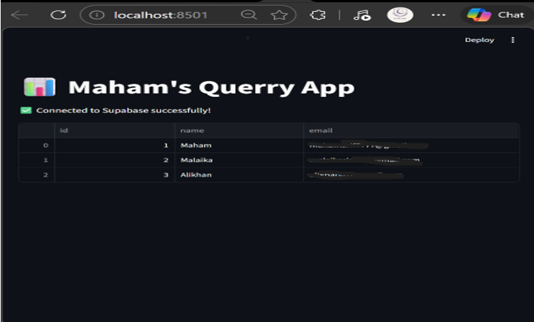
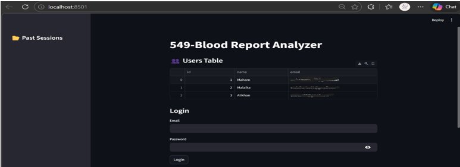
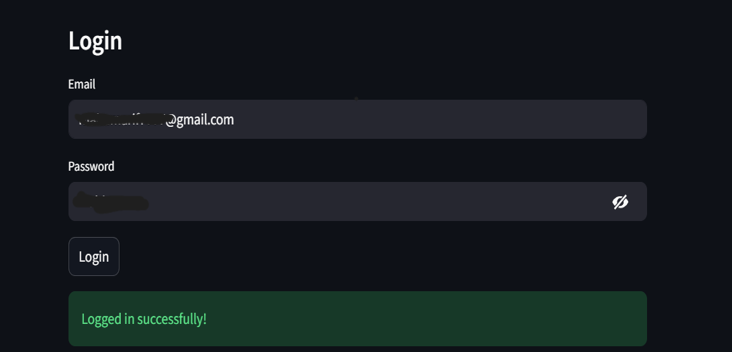
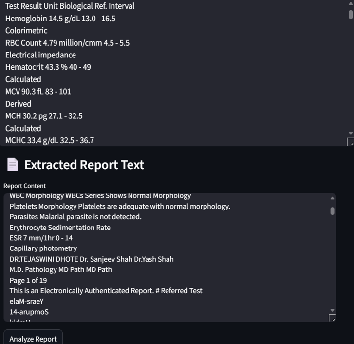
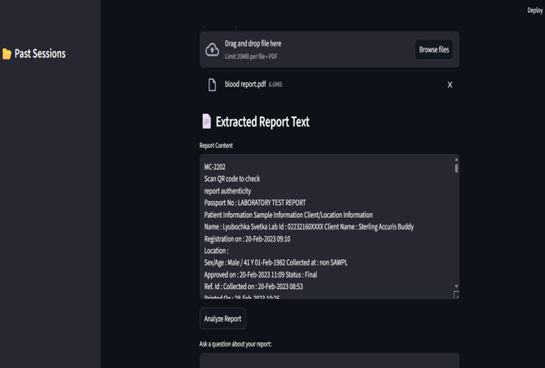
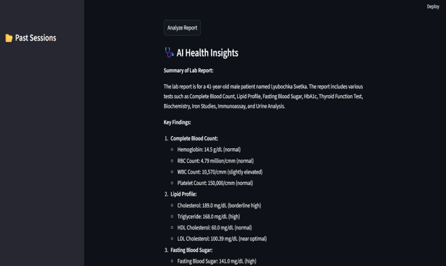
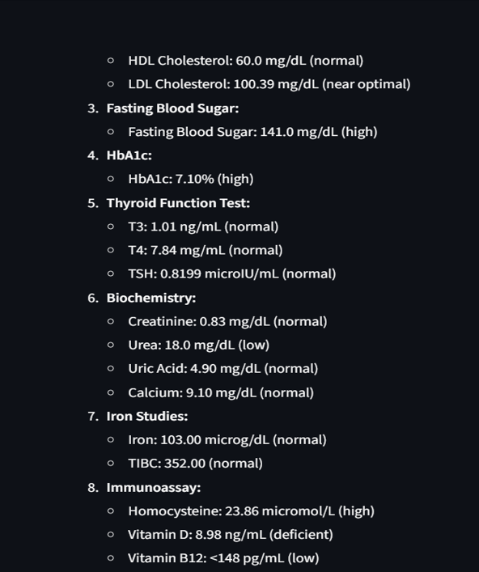
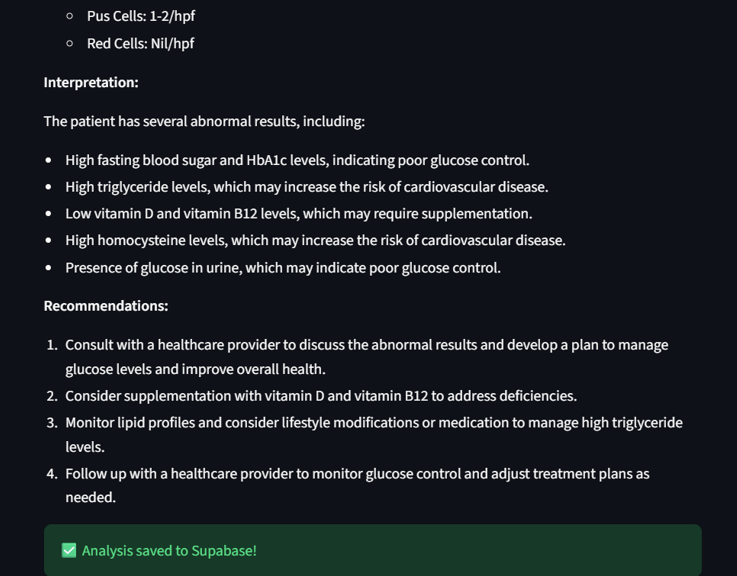
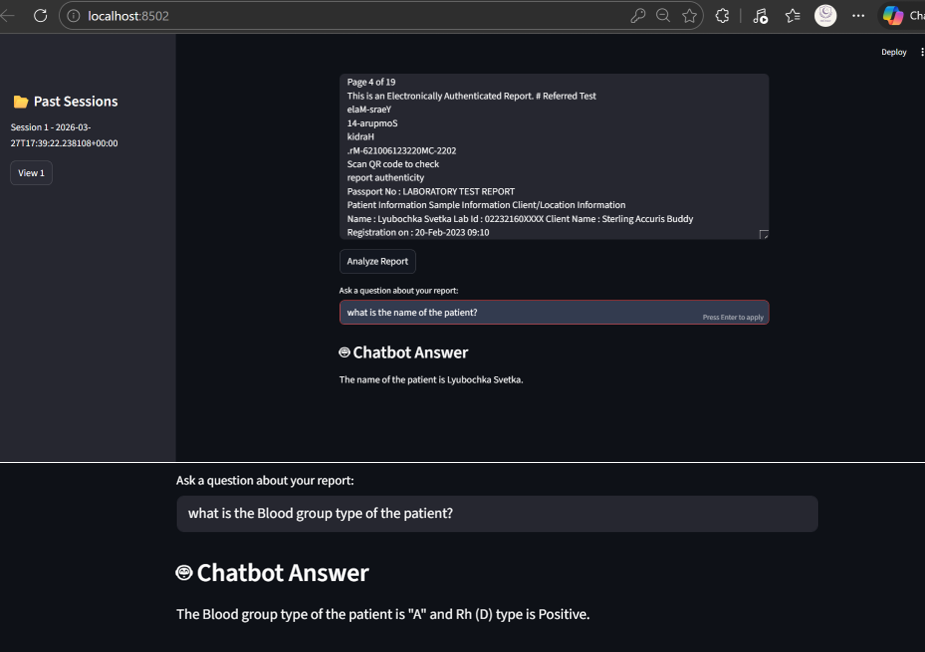
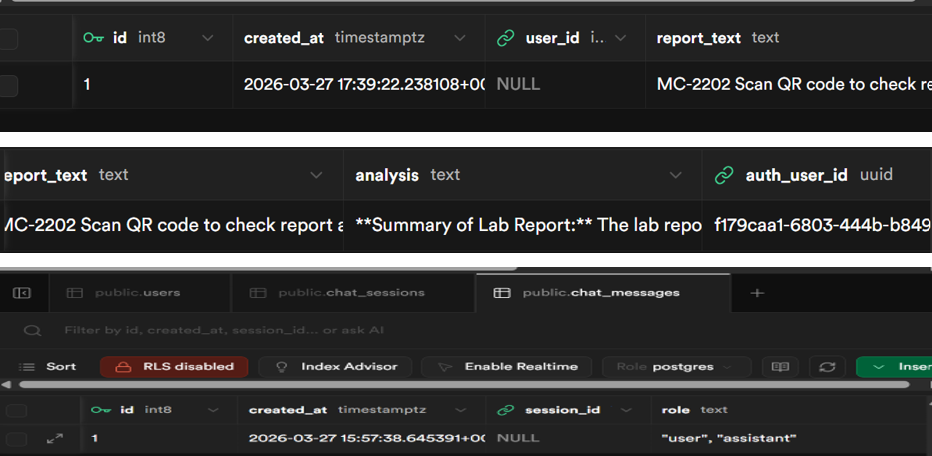

# 🩺 Blood Report Analyzer & Chatbot

An AI Agent built with **Python + Streamlit** that analyzes blood reports and provides detailed health insights.  
It also includes a chatbot for follow‑up questions, with all sessions stored securely in **Supabase**.

## Features
- Upload blood test reports in PDF format
- Extract text automatically using **PDFPlumber**
- Analyze reports with AI models (Groq / OpenAI)
- Save user login, sessions, and chat history in **Supabase**
- Interactive chatbot for follow‑up Q&A based on the report
- Simple and responsive **Streamlit UI**

## Tech Stack
- **Frontend/UI**: Streamlit
- **Database**: Supabase (PostgreSQL)
- **AI Models**: Groq / OpenAI GPT
- **Libraries**:
  - pdfplumber (PDF text extraction)
  - filetype (file validation)
  - langchain (LLM + RAG framework)
  - sentence‑transformers (embeddings)
  - FAISS (vector database for similarity search)

## Installation

### Requirements
- Python 3.8+
- Streamlit
- Supabase account
- Groq API key

### Setup Steps
1. **Clone the repository**:
   git clone https://github.com/YourUsername/Blood-Report-Analyzer.git
   cd Blood-Report-Analyzer

2. **Install Dependencies**:
   pip install -r requirements.txt

3. **Configure environment variables**:
Create a .env file in the project root:
SUPABASE_URL=your-supabase-url
SUPABASE_KEY=your-supabase-key
GROQ_API_KEY=your-groq-api-key

4. **Set up Supabase database**:
Create tables:
users
chat_sessions
chat_messages

5. **Run the application**:
streamlit run app.py

**Example Workflow**

Login with email & password (stored in Supabase).

Upload a blood report (PDF) → text is extracted.

Click Analyze Report → AI generates health insights.

Insights + session details are saved in Supabase.

Use the Chatbot to ask follow‑up questions about the report.

Chat history is stored in chat_sessions and chat_messages.

## Screenshots

### 1. Users Table

### 2. Login Page

### 3. Supabase Connection

### 4. Extracted Report Text

### 5. Hematology Report

### 6. AI Health Insights

### 7. Analysis Results

### 8. Blood Chemistry Report

### 9. Chatbot Q&A

### 10. Supabase Database Tables

